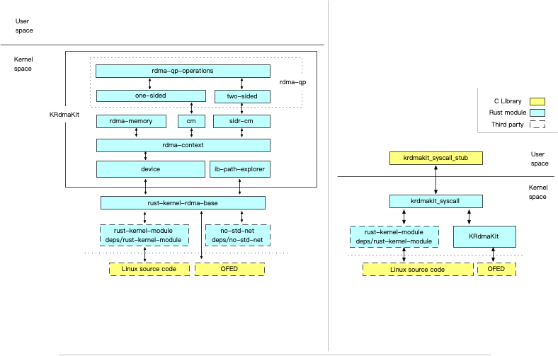

# KRCore: RDMA Support in Kernel-Land


KRCore provides RDMA support in kernel-land, with a microsecond-scale connect latency regardless of the cluster size. Apart from that, KRCore makes QP sharing possible and reduces memory consumption of queue pairs. The architecture of KRCore is shown as below:



## Seup KRCore environment

### Overview

1. Hardware preparation
   - One machine that supports IB RNIC
2. Software preparation
   - OS: Ubuntu16.04 and 18.04 are recommended
   - Linux kernel: 4.15.0-46-generic
   - MLNX_OFED driver: 4.9-3.1.5.0
   - Rustc: nightly-2020-11-10-x86_64
   - Clang-9

### Preparation for software

Suppose that the OS is Ubuntu16.04

#### 1. Change linux kernel

Under Ubuntu OS, apt/apt-get could be used directly to install the kernel. You may seek other ways by yourself on different OS (CentOS .etc)

```bash
$ sudo apt install linux-image-4.15.0-46-generic \
		linux-headers-4.15.0-46-generic -y
$ ## change the GRUB_DEFAULT in /etc/default/grub as 
$ ## GRUB_DEFAULT="Advanced options for Ubuntu>Ubuntu, with Linux 4.15.0-46-generic"
$ sudo reboot -n
```

#### 2. MLNX_OFED driver

See [init setp](https://github.com/Hf7WCdtO/KRCore/tree/master/mlnx-ofed-4.9-driver#init-step-assuming-ubuntu1604)

#### 3. Other essential software

##### Clang-9

There are two methods to install clang-9 on you machine.

M1: install clang using `apt`

```bash
$ wget https://apt.llvm.org/llvm.sh
$ chmod +x llvm.sh
$ sudo ./llvm.sh 9
```

M2: install clang using source binary

```bash
$ wget https://releases.llvm.org/9.0.0/clang+llvm-9.0.0-x86_64-linux-gnu-ubuntu-16.04.tar.xz
$ ## unzip the source file, rename it and add it to PATH directly
```

##### Rust & Cargo

```bash
$ curl --proto '=https' --tlsv1.2 https://sh.rustup.rs -sSf | sh
$ source $HOME/.cargo/env
$ rustup default nightly-2020-11-10-x86_64-unknown-linux-gnu
$ rustup component add rust-src
```

### Build KRCore kernel module

Now enter into path `KRdmaKit-syscall` and conduct `make` simply.

```bash
$ cd KRdmaKit-syscall
$ make 
$ sudo insmod KRdmaKitSyscall.ko
$ # sudo rmmod KRdmaKitSyscall /if want to uninstall the module
```


